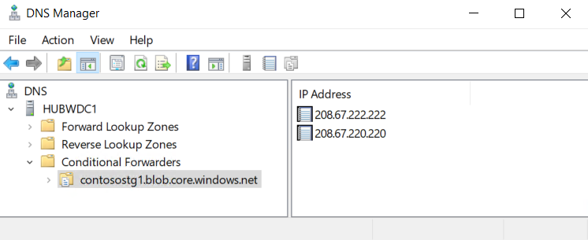
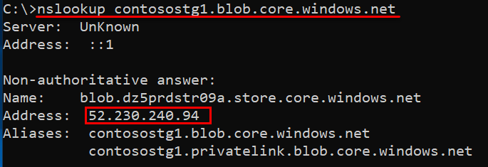
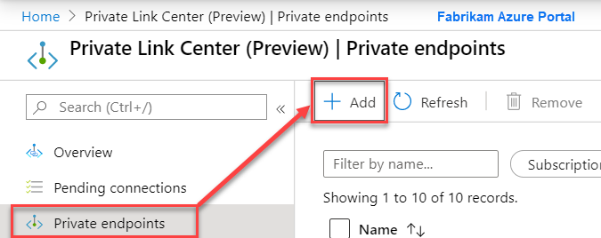
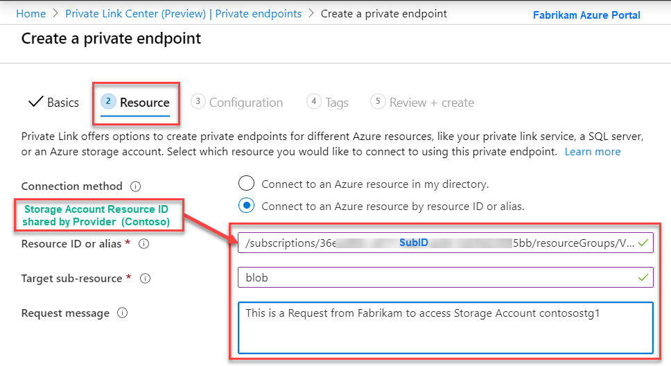
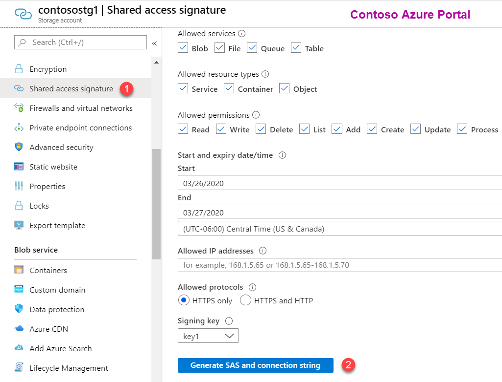

## Known Issue
Azure Customers are unable to access each other PaaS Resources when both sides are exposed to PrivateLink/Endpoint.

## Scenario A

Consider a scenario where Contoso Corporation is using Private Endpoint to access their Storage Accounts, example blog storage account name: **contosostg1**.
 - **ContosoVM1** -> Resolves Storage Account using **privatelink.blob.core.windows.net** to get private IP associated to Private Endpoint in order to access **contosostg1.blob.core.windows.net**.

In the other side Fabrikam is also using Private Endpoints to access their own Storage Accounts, for example **fabriakamstg1**, using same exact scenario as Contoso.
 - **FabrikamVM1** -> Resolves Storage Account using **privatelink.blob.core.windows.net** to get private IP associated to Private Endpoint in order to access **fabrikamstg1.blob.core.windows.net**.

For this scenario both customers host their respective **privatelink.blob.core.windows.net** zone using Azure Private DNS.

Contoso wants to allow Fabrikam to access a container named **orders** under storage account **contosostg1.blob.core.windows.net**.

## Scenario B

On this second scenario, Fabrikam has been accessing Contoso's storage account over Public IP for a long time but suddently after they enable Private Link they loose access to Contoso Storage Account **contosostg1.blob.core.windows.net**.

## Outcome for both Scenarios

Contoso expects Fabrikam to access their storage account using Public IP. However, when Fabrikam IT team tries to resolve **contosostg1.blob.core.windows.net** from FabrikamVM1 they detect that resolution does not work at all as shown:

1. Unable to ping **contosostg1.blob.core.windows.net** (name resolution failed to obtain IP).
2. Nslookup doesn't show error but no IP is resolved.
3. Resolved-DNSName cmdlet shows resolution stops when CNAME contosostg1.privatelink.blob.core.windows.net is triggered.

## Root Cause:
FabrikamVM1 is unable to resolve **contosostg1.blob.core.windows.net** because is using Private Link and has also CNAME for its name **fabrikamstg1.privatelink.blob.core.windows.net**. Because Fabrikam also hosts that Azure Private DNS zone **privatelink.blob.core.windows.net** they will be unable to get **contosostg1** Public IP.

Note that If you execute the same tests outside of Fabrikam environment (not integrated with Private DNS Zone for privatelink.blob.core.windows.net) resolution will bring Public IP fine.

You can validate that by either running **Nslookup**, **Resolve-DnsName** (PowerShell) or **Dig** against contosostg1.blob.core.windows.net as shown:

1. Public IP is returned fine.
2. You can confirm with this extra CNAME contosostg1.privatelink.blob.core.windows.net that storage account is exposed to Private Link/Endpoint (For more information on how DNS Name resolution works with PrivateLink here: [How DNS resolution works before and after Private Endpoints](https://github.com/dmauser/PrivateLink/tree/master/DNS-Integration-Scenarios#2-how-dns-resolution-works-before-and-after-private-endpoints) ).

## Solutions: 

There are two potential solutions for this issue:

1) Create a conditional forwarder for DNS name (FQDN) contosostg1.blob.core.windows.net and point to an Internet DNS resolver.

2) (**Recommended**) Expose **contosostg1** storage account via Private Link/Endpoint to Fabrikam be able to access it. More details can be found here: [Solution 2 - Expose Storage Account Cross-Tenant/Cross-Subscrition](https://github.com/dmauser/PrivateLink/tree/master/Issue-Customer-Unable-to-Access-PaaS-AfterPrivateLink#recommended-solution)

**Note** You can use (1) as short term solution and (2) as final solution because last one depends on effort of both parties (Fabrikam and Contoso) to make configuration to work properly.
 
## Solution 1 - Create a conditional forwarder for storage account DNS name (FQDN)

This solution requires a DNS Server that may sit on same Virtual Network or different Virtual Network or onpremises. In this case you need to add a similar conditional forwarder to an external Internet DNS resolvers such as 208.67.222.222 and 208.67.220.220 (OpenDNS Public Resolvers), 8.8.8.8 or 8.8.4.4 (Google DNS Public Resolvers):

Here is an example on Custom DNS Server using a conditional forwarder to storage account **contosostg1.blob.core.windows.net** (Note: full storage account FQDN name):

**Note:** It is important also not to make an authoritative zone (Primary Zone) for that storage FQDN (i.e. **contosostg1.blob.core.windows.net**) and manually add Public IP host record because Storage Account IP may change without any notification. Same applies for attempts to add it as entry on OS hosts file. Therefore, a conditional forwarder to an external resolver is the best choice to make.

After you implement woraround above all requests to **contosostg1.blob.core.windows.net** will be redirected to specified external Internet DNS resolvers and Public IP will be returned properly, example:

## Solution 2 - Expose Storage Account via Private Link/Endpoint (Cross-Tenant/Cross-Subscription)

Fabrikam has to create a Private Endpoint and request Private Link to contosostg1.blob.core.windows.net. After that DNS A (HOST) record for **contosostg1** inside AzurePrivate DNS zone privatelink.blob.core.windows.net hosted by Fabrikam in order to access it properly.

 **Note**: We may have other solutions such as adding a conditional forward to  **contosostg1.blob.core.windows.net** to get Public IP resolved but that will be added later in this document.

In order to create PrivateEndpoint on Fabrikam side. They have to request Contoso storage account contosostg1 ResourceID. In my using in this document it will be:
    /subscriptions/SubscriptionID/resourceGroups/RGTEST/providers/Microsoft.Storage/storageAccounts/contosostg1

### 1. Using that information Fabrikam start the process to create a Private Endpoint on their side using Azure Portal ###
(Screenshots in sequence - Basics, Resource, Configuration, Review+Create):

- **Step 1** - Add Private Private Endpoint

- **Step 2** - Select Subscription, Resource Group, Private Endpoint Name and Region.

- **Step 3** - On resource tab you have to add Storage Account Resource ID provided by Constoso. Example: /subscriptions/(Add **SubID**)/resourceGroups/RGTEST/providers/Microsoft.Storage/storageAccounts/contosostg1

- **Step 4** - Add target Virtual Network where Private Endpoint will reside. **Note** At this point Private DNS is not configured. You will to add record manually after you get Private Link request approved by Contoso.

- **Step 5** - Review all details and process by Create.

### 2. After Private Endpoint get Created you will see:

 1. Private Link Resource showing Storage Account name contosostg1.
 2. Connection Status as Pending because Contoso still need to approve Private Endpoint Request from Fabrikam
 3. DNS full name will be shown only after Contoso approval

### 3. Contoso now has to approve that request that came from Fabrikam. Steps below done over Azure Portal on Contoso side.

### 4. Storage Account on Contoso side now shows two Private Endpoint connected. First to local Subscription (Auto-Approved). Second is the one created mapping Private Endpoint on Fabrikam Subscription.

### 5. On Fabrikam side lets review the Private Endpoint Status:

### 6. An extra step needed here is to add record contosostg1 on Azure Private DNS Zone.

## Validation on FabrikamVM1 side:

### 1. Name Resolution:

### 2. Accessing Storage Acccount (Obtaining SAS access from Contoso).

2.1 - Generating SAS URL for Blob Storage.

2.2 - Contoso sends to Fabrikam link with SAS URI.

### 3. Fabrikan (logged on FabrikamVM) access Storage Account **contosostg1** via Azure Storage Explorer.

3.1 - Initiates connection with provided SAS URI:

3.2 - Access to Storage Account worked as expected:

3.2 - Checked Local Connections via **netstat** to ensure FabriamVM1 is accessing storage account over PrivateEndpoint:

